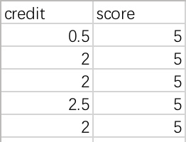
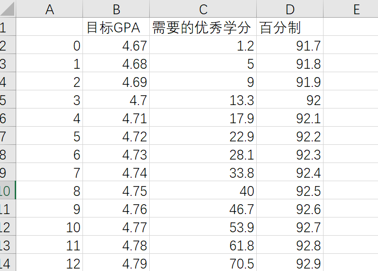
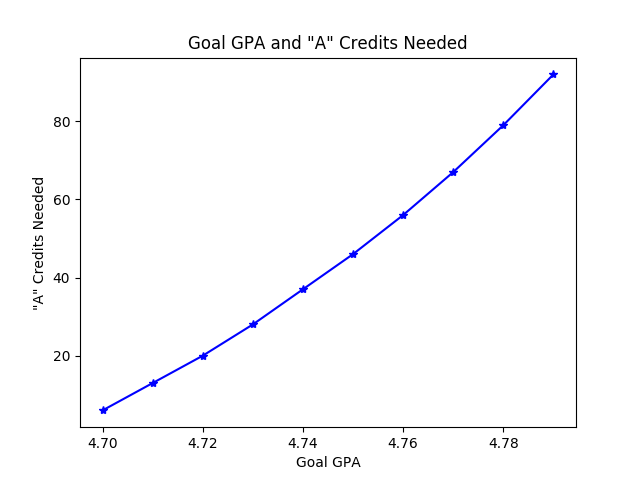

# 同济大学GPA规划工具

该程序用于同济大学学生根据自己现有成绩进行未来GPA预测与规划.

该程序可以通过输入现有成绩，输出未来四学期的预测最好GPA及精度为0.01的不同GPA目标的规划建议.

## 开发环境

Python3.6

- numpy 1.14.2
- pandas 0.20.3
- matplotlib 2.0.2

## 使用方法
### 输入格式



将自己的成绩以`credit,score`为表头存储.

第一列输入绩点，第二列输入五分制成绩.

分隔符使用`,`.

存储为`raw_GPA.csv`.

### 输出格式

将输出`goal_GPA.csv`文件和一张图表，形象地描述需要的优秀学分数与GPA的关系.





## 自定义
### 修改目标GPA上限

在calGPA函数中，修改如下参数：

```python
    boundary = 4.8
```

修改`4.8`为你需要的数字即可.

### 调整每学期学分

在calGPA函数中，修改如下参数：

```python
    credits_for_each_sem = 24
```

修改`24`为你需要的数字即可.