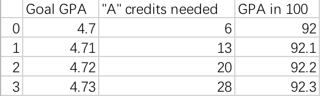

# 同济大学GPA规划工具

用于自己进行GPA规划

## 开发环境

Python3.6

- numpy 1.14.2
- pandas 0.20.3
- matplotlib 2.0.2

## 输入格式


CSV文件

## 输出格式



CSV文件

## 修改目标GPA上限

太懒了，所以手动改吧

calGPA函数中

```python
    boundary = 4.91
```

修改4.91处即可